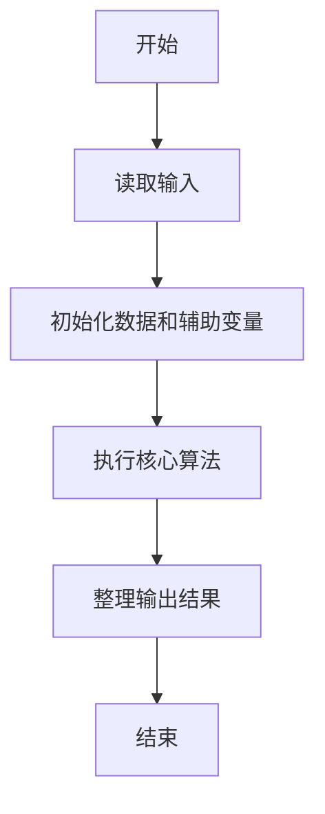
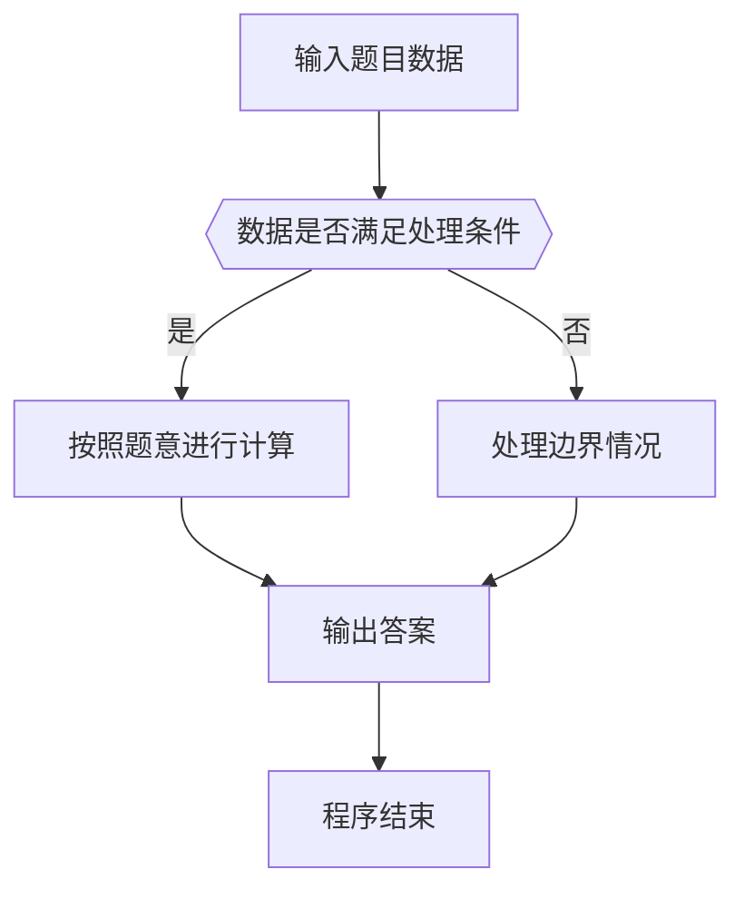

# 1004 成绩排名

- **分值：** 20分

### 题目描述

读入 $n$（$>0$）名学生的姓名、学号、成绩，分别输出成绩最高和成绩最低学生的姓名和学号。

### 输入格式：

每个测试输入包含 1 个测试用例，格式为
```
第 1 行：正整数 n
第 2 行：第 1 个学生的姓名 学号 成绩
第 3 行：第 2 个学生的姓名 学号 成绩
  ... ... ...
第 n+1 行：第 n 个学生的姓名 学号 成绩
```
其中`姓名`和`学号`均为不超过 10 个字符的字符串，成绩为 0 到 100 之间的一个整数，这里保证在一组测试用例中没有两个学生的成绩是相同的。

### 输出格式：

对每个测试用例输出 2 行，第 1 行是成绩最高学生的姓名和学号，第 2 行是成绩最低学生的姓名和学号，字符串间有 1 个空格。

### 输入样例：
```
3
Joe Math990112 89
Mike CS991301 100
Mary EE990830 95
```

### 输出样例：
```
Mike CS991301
Joe Math990112
```


### 解题思路

本题的核心是：顺序扫描所有学生记录，维护当前最高分和最低分及对应信息。程序先读取题目输入，再按照上述规则完成数据处理，最后严格按照题目要求输出结果。实现时应优先根据题目约束选择合适的数据类型和数据结构，避免溢出或不必要的重复计算。

时间复杂度为 O(n)；空间复杂度取决于输入规模，主要用于保存题目数据和中间结果。

### 代码流程说明

1. 读取 1004 成绩排名 所需的输入数据。
2. 初始化计数器、数组或其他辅助变量。
3. 顺序扫描所有学生记录，维护当前最高分和最低分及对应信息。
4. 按题目规定的格式输出计算结果。

### 代码实现

```cpp
/*
 * 题目：1004 成绩最大值与最小值
 * 实现原理：顺序扫描所有学生记录，维护当前最高分和最低分及对应信息。
 * 复杂度：O(n)
 * 实现步骤：
 * 1. 读取 1004 成绩排名 所需的输入数据。
 * 2. 初始化计数器、数组或其他辅助变量。
 * 3. 顺序扫描所有学生记录，维护当前最高分和最低分及对应信息。
 * 4. 按题目规定的格式输出计算结果。
 */
#include <cstdio>

int main() {
    int n, x;
    char name[105], id[105], hi[105] = "", hid[105] = "", lo[105] = "", loid[105] = "";
    int max = - 1, min = 101;
    scanf("%d", & n);
    while (n --) {
        scanf("%s %s %d", name, id, & x);
        if (x > max) {
            max = x;
            snprintf(hi, 105, "%s", name);
            snprintf(hid, 105, "%s", id);
        }
        if (x < min) {
            min = x;
            snprintf(lo, 105, "%s", name);
            snprintf(loid, 105, "%s", id);
        }
    }
    printf("%s %s\n%s %s\n", hi, hid, lo, loid);
    return 0;
}
```

### 代码流程图



### 解题流程图



### 常见易错点

- 注意输入数据的范围，选择足够大的整数类型，并正确处理边界值。
- 循环、数组下标和字符串结束位置要严格对应题目定义，避免越界。
- 输出格式必须与题目要求完全一致，包括空格、换行、大小写和特殊符号。
- 如果存在排序、去重、进位、约分或四舍五入等操作，应在输出前统一完成。
