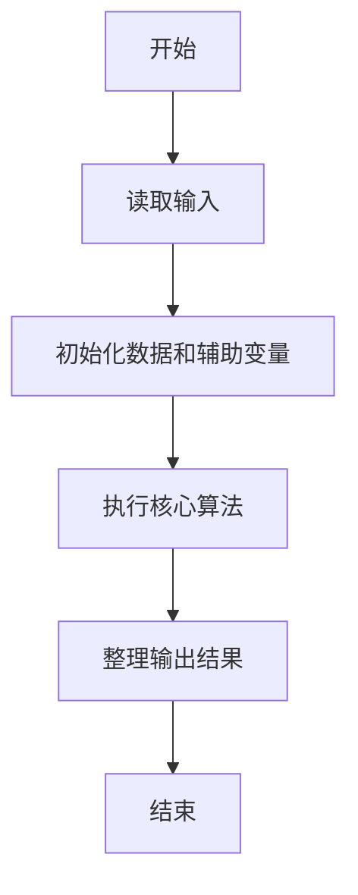
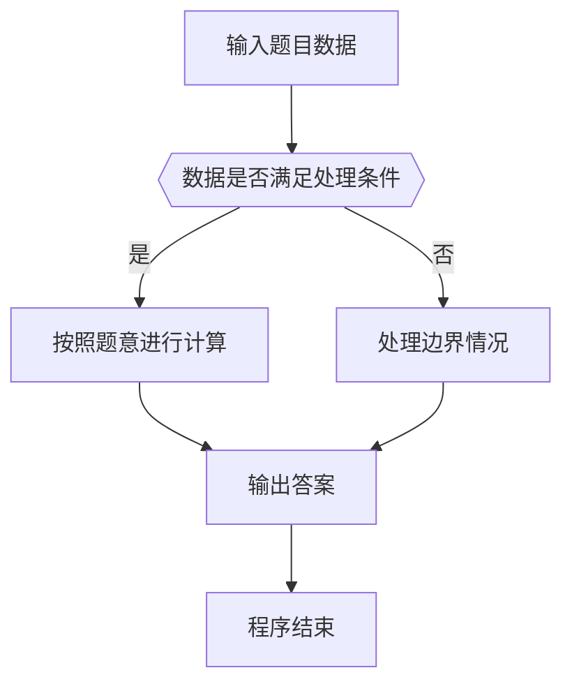

# 1034 有理数四则运算

- **分值：** 20分

### 题目描述

本题要求编写程序，计算 2 个有理数的和、差、积、商。

### 输入格式：

输入在一行中按照 `a1/b1 a2/b2` 的格式给出两个分数形式的有理数，其中分子和分母全是整型范围内的整数，负号只可能出现在分子前，分母不为 0。

### 输出格式：

分别在 4 行中按照 `有理数1 运算符 有理数2 = 结果` 的格式顺序输出 2 个有理数的和、差、积、商。注意输出的每个有理数必须是该有理数的最简形式 `k a/b`，其中 `k` 是整数部分，`a/b` 是最简分数部分；若为负数，则须加括号；若除法分母为 0，则输出 `Inf`。题目保证正确的输出中没有超过整型范围的整数。

### 输入样例 1：
```
2/3 -4/2
```

### 输出样例 1：
```
2/3 + (-2) = (-1 1/3)
2/3 - (-2) = 2 2/3
2/3 * (-2) = (-1 1/3)
2/3 / (-2) = (-1/3)
```

### 输入样例 2：
```
5/3 0/6
```

### 输出样例 2：
```
1 2/3 + 0 = 1 2/3
1 2/3 - 0 = 1 2/3
1 2/3 * 0 = 0
1 2/3 / 0 = Inf
```


### 解题思路

本题的核心是：使用分数结构保存分子分母，每步运算后约分并格式化输出。程序先读取题目输入，再按照上述规则完成数据处理，最后严格按照题目要求输出结果。实现时应优先根据题目约束选择合适的数据类型和数据结构，避免溢出或不必要的重复计算。

时间复杂度为 O(1)；空间复杂度取决于输入规模，主要用于保存题目数据和中间结果。

### 代码流程说明

1. 读取 1034 有理数四则运算 所需的输入数据。
2. 初始化计数器、数组或其他辅助变量。
3. 使用分数结构保存分子分母，每步运算后约分并格式化输出。
4. 按题目规定的格式输出计算结果。

### 代码实现

```cpp
/*
 * 题目：1034 四则运算
 * 实现原理：使用分数结构保存分子分母，每步运算后约分并格式化输出。
 * 复杂度：O(1)
 * 实现步骤：
 * 1. 读取 1034 有理数四则运算 所需的输入数据。
 * 2. 初始化计数器、数组或其他辅助变量。
 * 3. 使用分数结构保存分子分母，每步运算后约分并格式化输出。
 * 4. 按题目规定的格式输出计算结果。
 */
#include <cstdio>
#include <cstdlib>

typedef struct {
    long long n, d;
}
F;
long long g(long long a, long long b) {
    if (a < 0) a = - a;
    while (b) {
        long long t = a % b;
        a = b;
        b = t;
    }
    return a ? a : 1;
}
F norm(F x) {
    if (x.d < 0) x.n = - x.n, x.d = - x.d;
    long long z = g(x.n, x.d);
    x.n /= z;
    x.d /= z;
    return x;
}
void pr(F x) {
    x = norm(x);
    if (x.n == 0) {
        printf("0");
        return;
    }
    long long sign = x.n < 0 ? - 1 : 1;
    long long n = x.n < 0 ? - x.n : x.n;
    long long whole = n / x.d, rest = n % x.d;
    if (rest == 0) {
        if (sign < 0) printf("(-%lld)", whole);
        else printf("%lld", whole);
    } else if (whole == 0) {
        if (sign < 0) printf("(-%lld/%lld)", n, x.d);
        else printf("%lld/%lld", n, x.d);
    } else if (sign < 0) printf("(-%lld %lld/%lld)", whole, rest, x.d);
    else printf("%lld %lld/%lld", whole, rest, x.d);
}
int main() {
    F a, b;
    scanf("%lld/%lld %lld/%lld", & a.n, & a.d, & b.n, & b.d);
    F r[4] = {
        {
            a.n * b.d + b.n * a.d, a.d * b.d
        }, {
            a.n * b.d - b.n * a.d, a.d * b.d
        }, {
            a.n * b.n, a.d * b.d
        }, {
            a.n * b.d, a.d * b.n
        }
    };
    const char op[] = "+-*/";
    for (int i = 0; i < 4; i ++) {
        pr(a);
        printf(" %c ", op[i]);
        pr(b);
        printf(" = ");
        if (i == 3 && b.n == 0) printf("Inf\n");
        else {
            pr(r[i]);
            putchar('\n');
        }
    }
    return 0;
}
```

### 代码流程图



### 解题流程图



### 常见易错点

- 注意输入数据的范围，选择足够大的整数类型，并正确处理边界值。
- 循环、数组下标和字符串结束位置要严格对应题目定义，避免越界。
- 输出格式必须与题目要求完全一致，包括空格、换行、大小写和特殊符号。
- 如果存在排序、去重、进位、约分或四舍五入等操作，应在输出前统一完成。
