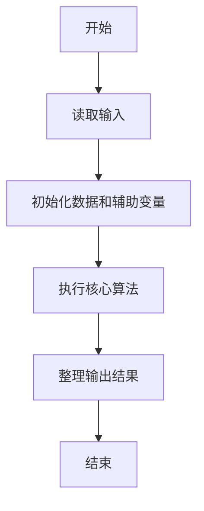
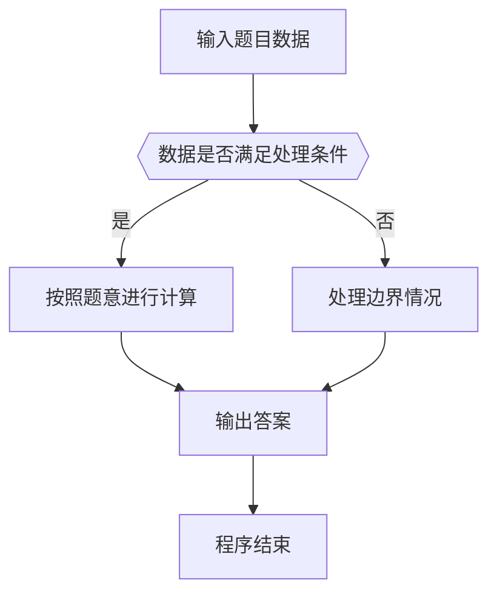

# 1037 在霍格沃茨找零钱

- **分值：** 20分

### 题目描述

如果你是哈利·波特迷，你会知道魔法世界有它自己的货币系统 —— 就如海格告诉哈利的：“十七个银西可(Sickle)兑一个加隆(Galleon)，二十九个纳特(Knut)兑一个西可，很容易。”现在，给定哈利应付的价钱 $P$ 和他实付的钱 $A$，你的任务是写一个程序来计算他应该被找的零钱。

### 输入格式：

输入在 1 行中分别给出 $P$ 和 $A$，格式为 `Galleon.Sickle.Knut`，其间用 1 个空格分隔。这里 `Galleon` 是 [0, $10^7$] 区间内的整数，`Sickle` 是 [0, 17) 区间内的整数，`Knut` 是 [0, 29) 区间内的整数。

### 输出格式：

在一行中用与输入同样的格式输出哈利应该被找的零钱。如果他没带够钱，那么输出的应该是负数。

### 输入样例 1：
```
10.16.27 14.1.28
```

### 输出样例 1：
```
3.2.1
```

### 输入样例 2：
```
14.1.28 10.16.27
```

### 输出样例 2：
```
-3.2.1
```


### 解题思路

本题的核心是：把加隆、纳特、克努特统一换算成最小单位后相加，再逐级换回。程序先读取题目输入，再按照上述规则完成数据处理，最后严格按照题目要求输出结果。实现时应优先根据题目约束选择合适的数据类型和数据结构，避免溢出或不必要的重复计算。

时间复杂度为 O(1)；空间复杂度取决于输入规模，主要用于保存题目数据和中间结果。

### 代码流程说明

1. 读取 1037 在霍格沃茨找零钱 所需的输入数据。
2. 初始化计数器、数组或其他辅助变量。
3. 把加隆、纳特、克努特统一换算成最小单位后相加，再逐级换回。
4. 按题目规定的格式输出计算结果。

### 代码实现

```cpp
/*
 * 题目：1037 在霍格沃茨找零钱
 * 实现原理：把加隆、纳特、克努特统一换算成最小单位后相加，再逐级换回。
 * 复杂度：O(1)
 * 实现步骤：
 * 1. 读取 1037 在霍格沃茨找零钱 所需的输入数据。
 * 2. 初始化计数器、数组或其他辅助变量。
 * 3. 把加隆、纳特、克努特统一换算成最小单位后相加，再逐级换回。
 * 4. 按题目规定的格式输出计算结果。
 */
#include <cstdio>

long long val(long long g, long long s, long long k) {
    return(g * 17 + s) * 29 + k;
}
int main() {
    long long g1, s1, k1, g2, s2, k2;
    scanf("%lld.%lld.%lld %lld.%lld.%lld", & g1, & s1, & k1, & g2, & s2, & k2);
    long long x = val(g2, s2, k2) - val(g1, s1, k1);
    char sign = x < 0 ? '-' : 0;
    if (x < 0) x = - x;
    long long k = x % 29;
    x /= 29;
    long long s = x % 17, g = x / 17;
    if (sign) putchar(sign);
    printf("%lld.%lld.%lld\n", g, s, k);
    return 0;
}
```

### 代码流程图



### 解题流程图



### 常见易错点

- 注意输入数据的范围，选择足够大的整数类型，并正确处理边界值。
- 循环、数组下标和字符串结束位置要严格对应题目定义，避免越界。
- 输出格式必须与题目要求完全一致，包括空格、换行、大小写和特殊符号。
- 如果存在排序、去重、进位、约分或四舍五入等操作，应在输出前统一完成。
